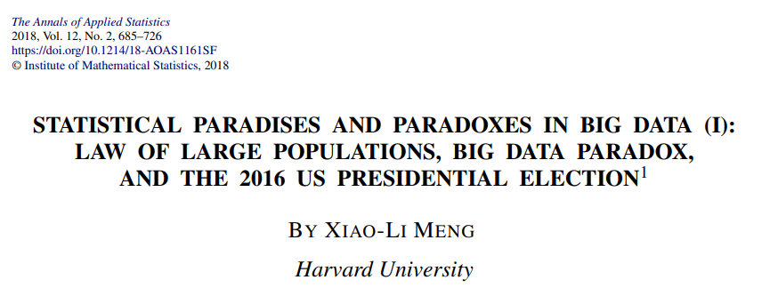
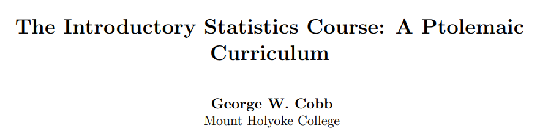
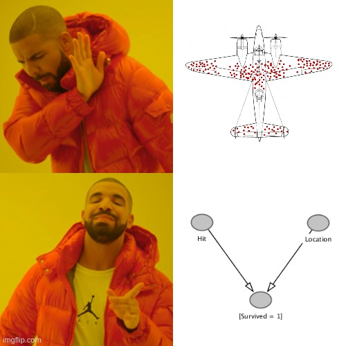

```{r setup, include=FALSE}
options(htmltools.dir.version = FALSE)
library(icons)
```

```{r xaringan-themer, include=FALSE, warning=FALSE}
library(xaringanthemer)
knitr::opts_chunk$set(fig.dim=c(4.8, 4.5), fig.retina=2, out.width="80%")
style_xaringan(
  header_color = "#00998A",
  inverse_background_color = "#00998A",
  background_color = "#f3f3f3",
  base_font_size = "24px",
  text_font_size = "1.2rem",
  footnote_font_size = "0.7rem",
  colors =c(
    grey = "#5E6974",
    green = "#00998A",
    red = "#F34213",
    blue = "#0000FF",
    orange = "#FF8811",
    violet = "#DA70D6",
    purple = "#7A378B",
    olive = "#808000"),  extra_css = list(
    ".small" = list("font-size" = "90%"),
    ".large" = list("font-size" = "120%"),
    ".Large" = list("font-size" = "180%")
    )
  )
```

class: center, inverse, middle

# Intro

---


## Why data anyway?

$$\color{green}{Estimate} =\color{blue}{Estimand} + \color{purple}{Bias} + \color{orange}{Noise}$$

- .green[*Estimate*]: Result based on our <mark>data</mark>. Quite often a *statistic*,  e.g., $\color{green}{p, \bar{x}, r}$.

- .blue[*Estimand*]: Unobserved <mark>quantity we are interested in</mark>. Quite often a *parameter*,  e.g., $\color{blue}{\pi, \mu, \rho}$.

- .purple[*Bias*]: Systematic difference between estimate and estimand, due to e.g., sampling or omitted variable bias.

- .orange[*Noise*]: Random differences due to sample.


.footnote[[Bueno de Mesquita and Fowler (2021)](https://press.princeton.edu/books/paperback/9780691214351/thinking-clearly-with-data)]

---

## Big Data Paradox

.pull-left[

```{r echo=FALSE, fig.align='center', out.width='95%'}

```

[https://doi.org/10.1214/18-AOAS1161SF](https://doi.org/10.1214/18-AOAS1161SF)

]

.pull-right[

> compensating for quality with quantity is a doomed game

]

---

## Bias Protection: Randomize

.pull-left[

```{r echo=FALSE, fig.align='center', out.width='95%'}

```

[http://dx.doi.org/10.5070/T511000028](http://dx.doi.org/10.5070/T511000028)

]

.pull-right[

> One of the most important things our students should take away from an introductory course is the habit of always asking, “Where was the randomization, and what inferences does it support”

]

---

## The Wrong Lesson


[Danny Kaplan](https://cause.vmhost.psu.edu/cause/sites/default/files/uscots/uscots13/opening/6_Daniel_Kaplan.pdf):

> *What I was saying ...*
Data don’t speak, they inform our judgment. Interpret data in the context of a whole system.

--

> *What they were hearing ...*
The data will say anything you want, depending on how you cut it.

--

<br> 

.center[.fom[How can we provide a framework to discuss the data generating process with students?]]

---

class: center, inverse, middle

# Causal Diagrams

---

## An Arrow

- $\color{green}{X} \rightarrow \color{blue}{Y}: \quad \color{blue}{Y}=f(\color{green}{X}, U_{\color{blue}{Y}})$ with some function $f(\cdot)$ and some exogenous $U$. 

- The value of $\color{blue}{Y}$ depends on $\color{green}{X}$ -- but the value of $\color{green}{X}$ .red[not] on $\color{blue}{Y}$. 

- Causally, there is no inverse function $f^{-1}(\cdot)$. My .blue[weight] growths with my .green[height] but unfortunately my .green[height] not with my .blue[weight] &#x1F625;

---

## Convenience vs. Random Sample

&#x1F469;&#x200D;&#x1F3EB; wants to know the learning time of her students:

```{r echo=FALSE, fig.align='center', out.width='70%'}
knitr::include_graphics("img/Sampling.png")
```

---

## Observational Study vs. Randomized Trial

&#x1F469;&#x200D;&#x1F3EB; wants to know the effect of learning time on test score:

```{r echo=FALSE, fig.align='center', out.width='70%'}
knitr::include_graphics("img/Experiment.png")
```


---

class: center, inverse, middle

# Evaluation

---

## Sample

- Two instructors, seven statistics-related courses for non-majors.

- Question integrated in regular classroom response system.

- Single Question, pre- and post-lecture.

- $n_{pre}=282$, $n_{post}=280$. Feedback on helpfullnes of graph by $n_{eval}=230$.

---

## Question

On an internet platform, 10,000 people report a positive effect of a particular shampoo on gray hair (Study A). An experiment with 100 randomly selected people finds no positive effect of the shampoo (Study B). With the information given, the result of which study is more credible?

- A: The result of study A

- B: The result of study B

- C: Both studies are equally credible

---

## Results

- For (correct) answer B: $p_{pre}=49.6\,\%$, $p_{post}=62.5\,\%$.

- Statistical discernible positive effect ( $p\text{-}value=0.0012$, Cohen's $h=0.26$).

- Limitations: Observational study within the classes.

---

## Feedback

The diagrams (graphs) to describe the data generating process are helpful to understand concepts of data collection (randomized sampling and allocation).

```{r echo=FALSE, fig.align='center', out.width='65%'}
knitr::include_graphics("img/Evaluation.png")
```

---

class: center, inverse, middle

# Outro

---

## Directed Acycic Graph (Surgery)

.pull-left[
```{r echo=FALSE, fig.align='center', out.width='65%'}

```

.footnote[[Source](https://doi.org/10.1371/journal.pcbi.1006764.g001)] 
]


.pull-right[
- Graphs provide a language to discuss the data generating process.
- Random sampling removes arrows into $S$.
- Random allocation (RCT) removes arrows into $X$.
]

---

## Conclusions

- In a world full of big data and many studies published based on the analysis of such data, we,
as statistics and data-science educators, face the challenge of how we can help our students to draw
correct conclusions. The latter is essential even on a purely descriptive level. 

- Causal diagrams may provide an easy-to-grasp language to discuss the assumptions
about the data-generating process. With these diagrams, instructors can formally assess confounding
and bias and illustrate the important benefits of random sampling and/or random allocation.

---

## Further Reading

- Cummiskey, K., Adams, B., Pleuss, J., Turner, D., Clark, N. & Watts, K. (2020). Causal inference in introductory statistics courses. *Journal of Statistics Education*, 28(1), 2–8. [https://doi.org/10.1080/10691898.2020.1713936](https://doi.org/10.1080/10691898.2020.1713936)

- Greenland, S. (2022). The causal foundations of applied probability and statistics. In H. Geffner, R.
Dechter, & J. Y. Halpern (Eds.), *Probabilistic and causal inference: The works of Judea Pearl* (1st ed., pp. 605–624).
Association for Computing Machinery. [https://doi.org/10.1145/3501714.3501747](https://doi.org/10.1145/3501714.3501747)

- Lübke, K., Gehrke, M., Horst, J. & Szepannek, G. (2020). Why we should teach causal inference:
Examples in linear regression with simulated data. *Journal of Statistics Education*, 28(2), 133–139.
[https://doi.org/10.1080/10691898.2020.1752859](https://doi.org/10.1145/3501714.3501747)

---

## The End

.center[`r icon_style(fontawesome("heart", style = "solid"), fill = "#F92672")` Thank you for your participation `r icon_style(fontawesome("heart", style = "solid"), fill = "#F92672")`]

<br>

- `r fontawesome$brands$github` (Data and Analysis):  [https://github.com/luebby/ICOTS-2022](https://github.com/luebby/ICOTS-2022)

<br>

- `r fontawesome("envelope", style = "solid")`:  [karsten.luebke@fom.de](<mailto:karsten.luebke@fom.de>), [matthias.gehrke@fom.de](<mailto:matthias.gehrke@fom.de>)

- `r fontawesome("twitter", style = "brands")`:  [@luebby42](https://twitter.com/luebby42)
