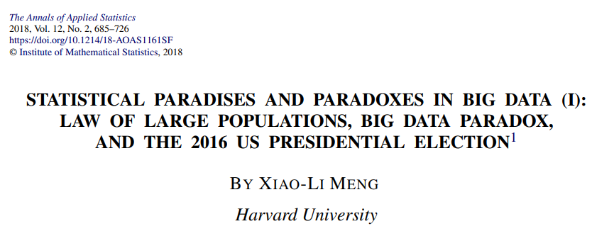
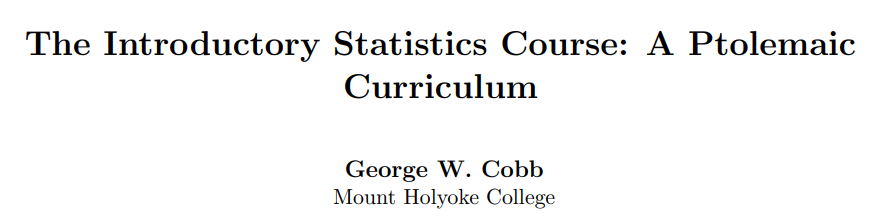
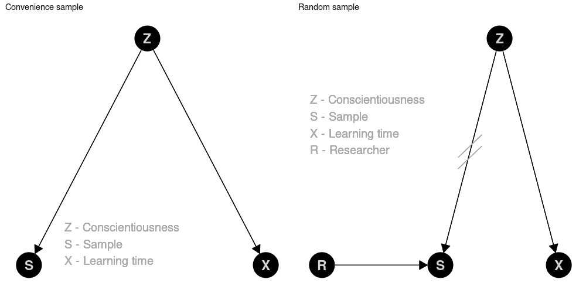
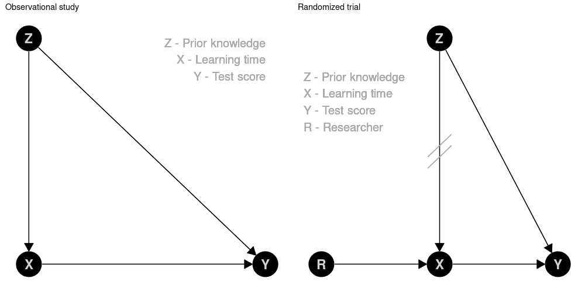
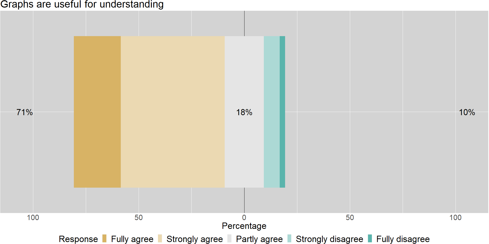

```{r setup, include=FALSE}
options(htmltools.dir.version = FALSE)
library(icons)
```

```{r xaringan-themer, include=FALSE, warning=FALSE}
library(xaringanthemer)
knitr::opts_chunk$set(fig.dim=c(4.8, 4.5), fig.retina=2, out.width="80%")
style_xaringan(
  header_color = "#00998A",
  inverse_background_color = "#00998A",
  background_color = "#f3f3f3",
  base_font_size = "24px",
  text_font_size = "1.2rem",
  footnote_font_size = "0.7rem",
  colors =c(
    grey = "#5E6974",
    green = "#00998A",
    red = "#F34213",
    blue = "#0000FF",
    orange = "#FF8811",
    violet = "#DA70D6",
    purple = "#7A378B",
    olive = "#808000"),  extra_css = list(
    ".small" = list("font-size" = "90%"),
    ".large" = list("font-size" = "120%"),
    ".Large" = list("font-size" = "180%")
    )
  )
```

class: center, inverse, middle

# Intro

---


## ¿Por qué datos de todos modos?

$$\color{green}{Estimar} =\color{blue}{estimación} + \color{purple}{Parcialidad} + \color{orange}{Ruido}$$

- .green[*Estimar*]: Resultado basado en nuestra <mark>datos</mark>. Muy a menudo una *estadística*,  p.ej., $\color{green}{p, \bar{x}, r}$.

- .blue[*estimación*]:<mark>Cantidad no observada que nos interesa</mark>. Muy a menudo un *parámetro*,  p.ej., $\color{blue}{\pi, \mu, \rho}$.

- .purple[*Parcialidad*]: Diferencia sistemática entre Estimar y estimación, debido a p.ej., muestreo o variable omitida Parcialidad.

- .orange[*Ruido*]: Diferencias aleatorias debidas a la muestra.


.footnote[[Bueno de Mesquita and Fowler (2021)](https://press.princeton.edu/books/paperback/9780691214351/thinking-clearly-with-data)]

---

## Paradoja de los grandes datos

.pull-left[

```{r echo=FALSE, fig.align='center', out.width='95%'}

```

[https://doi.org/10.1214/18-AOAS1161SF](https://doi.org/10.1214/18-AOAS1161SF)

]

.pull-right[

> compensar la calidad con la cantidad es un juego condenado

]

---

## Protección de Parcialidad: Aleatorizar

.pull-left[

```{r echo=FALSE, fig.align='center', out.width='95%'}

```

[http://dx.doi.org/10.5070/T511000028](http://dx.doi.org/10.5070/T511000028)

]

.pull-right[

> Una de las cosas más importantes que nuestros estudiantes deben aprender de un curso introductorio es el hábito de preguntar siempre: "¿Dónde estaba la aleatorización y qué inferencias admite?"

]

---

## La lección equivocada


[Danny Kaplan](https://cause.vmhost.psu.edu/cause/sites/default/files/uscots/uscots13/opening/6_Daniel_Kaplan.pdf):

> *Lo que estaba diciendo...*
Los datos no hablan, informan nuestro juicio. Interpretar datos en el contexto de un sistema completo.

--

> *Lo que estaban escuchando...*
Los datos dirán lo que quieras, dependiendo de cómo los cortes.
--

<br> 

.center[.fom[¿Cómo podemos proporcionar un marco para discutir el proceso de generación de datos con los estudiantes?]]

---

class: center, inverse, middle

# diagramas causales

---

## An Arrow

- $\color{green}{X} \rightarrow \color{blue}{Y}: \quad \color{blue}{Y}=f(\color{green}{X}, U_{\color{blue}{Y}})$ con alguna funcion $f(\cdot)$ y algunos exógenos $U$. 

- El valor de $\color{blue}{Y}$ depende de $\color{green}{X}$ -- pero el valor de $\color{green}{X}$ .red[no] en $\color{blue}{Y}$. 

- Causalmente, no hay una función inversa. $f^{-1}(\cdot)$. Mi .blue[peso] crece con mi .green[altura] pero desafortunadamente mi .green[altura] no con mi .blue[peso] &#x1F625;

---

## Conveniencia versus muestra aleatoria

&#x1F469;&#x200D;&#x1F3EB; quiere saber el tiempo de aprendizaje de sus alumnos:

```{r echo=FALSE, fig.align='center', out.width='70%'}

```

---

## Estudio observacional versus ensayo aleatorizado

&#x1F469;&#x200D;&#x1F3EB; quiere saber el efecto del tiempo de aprendizaje en la puntuación de la prueba:

```{r echo=FALSE, fig.align='center', out.width='70%'}

```


---

class: center, inverse, middle

# Evaluación

---

## Muestra

- Dos instructores, siete cursos relacionados con la estadística para no mayores.

- Pregunta integrada en el sistema de respuesta habitual del aula.

- Pregunta única, antes y después de la conferencia.

- $n_{pre}=282$, $n_{post}=280$. Comentarios sobre la utilidad del gráfico por $n_{eval}=230$.

---

## Pregunta

En una plataforma de Internet, 10.000 personas reportan un efecto positivo de un champú en particular sobre el cabello gris (Estudio A). Un experimento con 100 personas seleccionadas al azar no encuentra ningún efecto positivo del champú (Estudio B). Con la información dada, ¿el resultado de qué estudio es más creíble?

- A: El resultado del estudio A

- B: El resultado del estudio B

- C: Ambos estudios son igualmente creíbles.

---

## Resultados

- Para la respuesta (correcta) B: $p_{pre}=49.6\,\%$, $p_{post}=62.5\,\%$.

- Efecto positivo perceptible estadísticamente ( $p\text{-}valor=0.0012$, Cohen's $h=0.26$).

- Limitaciones: estudio observacional dentro de las clases.

---

## Retroalimentación

Los diagramas (gráficos) para describir el proceso de generación de datos son útiles para comprender los conceptos de recopilación de datos (muestreo y asignación aleatorios).

```{r echo=FALSE, fig.align='center', out.width='65%'}

```

---

class: center, inverse, middle

# Outro

---

## Gráfico acíclico dirigido (cirugía)

.pull-left[
```{r echo=FALSE, fig.align='center', out.width='65%'}
knitr::include_graphics("img/DAG-Wald.jpg")
```

.footnote[[Source](https://doi.org/10.1371/journal.pcbi.1006764.g001)] 
]


.pull-right[
- Los gráficos proporcionan un lenguaje para discutir el proceso de generación de datos.
- El muestreo aleatorio elimina las flechas en $S$.
- La asignación aleatoria elimina las flechas en $X$.
]

---

## Conclusiones

- En un mundo lleno de big data y muchos estudios publicados basados en el análisis de dichos datos, nosotros,
como educadores de estadística y ciencia de datos, enfrentamos el desafío de cómo podemos ayudar a nuestros estudiantes a dibujar
conclusiones correctas. Este último es esencial incluso en un nivel puramente descriptivo.

- Los diagramas causales pueden proporcionar un lenguaje fácil de entender para discutir los supuestos.
sobre el proceso de generación de datos. Con estos diagramas, los instructores pueden evaluar formalmente los factores de confusión
y Parcialidad e ilustrar los importantes beneficios del muestreo aleatorio y/o la asignación aleatoria.

---

## Otras lecturas

- Cummiskey, K., Adams, B., Pleuss, J., Turner, D., Clark, N. & Watts, K. (2020). Causal inference in introductory statistics courses. *Journal of Statistics Education*, 28(1), 2–8. [https://doi.org/10.1080/10691898.2020.1713936](https://doi.org/10.1080/10691898.2020.1713936)

- Greenland, S. (2022). The causal foundations of applied probability and statistics. In H. Geffner, R.
Dechter, & J. Y. Halpern (Eds.), *Probabilistic and causal inference: The works of Judea Pearl* (1st ed., pp. 605–624).
Association for Computing Machinery. [https://doi.org/10.1145/3501714.3501747](https://doi.org/10.1145/3501714.3501747)

- Lübke, K., Gehrke, M., Horst, J. & Szepannek, G. (2020). Why we should teach causal inference:
Examples in linear regression with simulated data. *Journal of Statistics Education*, 28(2), 133–139.
[https://doi.org/10.1080/10691898.2020.1752859](https://doi.org/10.1145/3501714.3501747)

---

## El fin

.center[`r icon_style(fontawesome("heart", style = "solid"), fill = "#F92672")` Gracias por su participación `r icon_style(fontawesome("heart", style = "solid"), fill = "#F92672")`]

<br>

- `r fontawesome$brands$github` (Datos y análisis):  [https://github.com/luebby/ICOTS-2022](https://github.com/luebby/ICOTS-2022)

<br>

- `r fontawesome("envelope", style = "solid")`:  [karsten.luebke@fom.de](<mailto:karsten.luebke@fom.de>), [matthias.gehrke@fom.de](<mailto:matthias.gehrke@fom.de>)

- `r fontawesome("twitter", style = "brands")`:  [@luebby42](https://twitter.com/luebby42)
